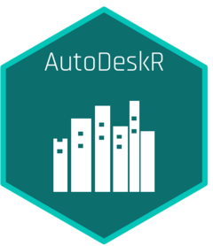

# AutoDeskR 

<!-- badges: start -->

<!-- badges: end -->

## Introduction

AutoDeskR is an R package that provides an interface to the:

- Authentication API for obtaining authentication to the AutoDesk
  Platform Services (APS).
- Data Management API for managing data across the platform’s cloud
  services.
- Design Automation API for performing automated tasks on model files in
  the cloud.
- Model Derivative API for translating design files into different
  formats, sending them to the viewer app, and extracting model data.
- Viewer for rendering 2D and 3D models.

## Quick Start

To install AutoDeskR in [R](https://www.r-project.org):

    install.packages("AutoDeskR")

Or to install the development version:

    devtools::install_github('paulgovan/autodeskr')

## Code of Conduct

Please note that the AutoDeskR project is released with a [Contributor
Code of
Conduct](http://paulgovan.github.io/AutoDeskR/CODE_OF_CONDUCT.html). By
contributing to this project, you agree to abide by its terms.

## Acknowledgements

Many thanks to the developers at <https://aps.autodesk.com> for
providing this great set of tools and for the support needed to learn
and implement these APIs.
